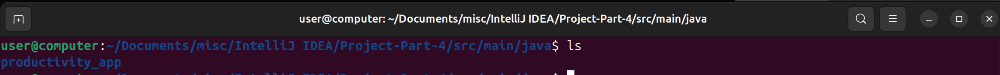
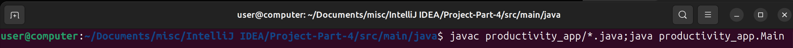
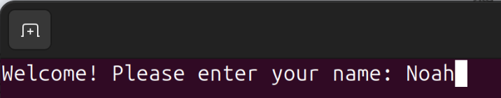
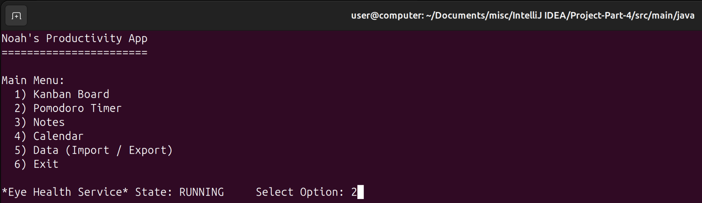

## Run Instructions (in Linux Bash Terminal)

1. Navigate to the directory that the 'productivity_app' package is in

3. Execute these commands to compile all java files and run the driver program: `javac productivity_app/*.java;java productivity_app.Main`

